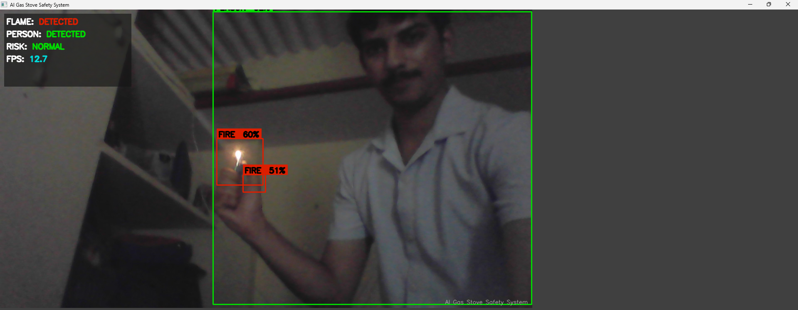
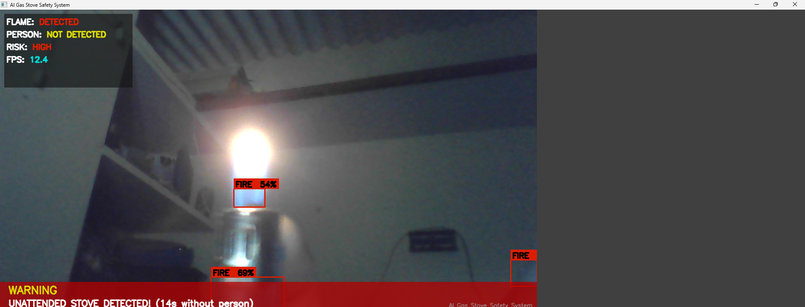

# AI Gas Stove Safety System

A real-time computer vision prototype that watches a kitchen through a webcam, detects an active flame, and raises an alert if no person has been nearby for a configurable period of time.

---

## Features

- Real-time webcam capture and display loop (OpenCV)
- Person detection using a pre-trained YOLOv8n model, filtered to the `person` class
- Flame detection using an HSV colour-thresholding heuristic (no trained fire model — see [Known Limitations](#known-limitations))
- Stateful "unattended stove" logic that escalates to a `HIGH` risk level once a flame has been visible for longer than a configurable threshold without a person present
- On-screen overlays: bounding boxes with label/confidence chips, a status panel (flame / person / risk / FPS), and a full-width warning banner during a `HIGH` risk event
- Throttled alerting: console alert and an optional sound alert, both dispatched on background daemon threads with a cooldown so repeated frames don't spam the alert channel
- A stubbed (not implemented) Telegram alert channel, left as a documented extension point
- Modular source layout — detection, decision logic, alerting, and rendering each live in their own file with no cross-cutting state

---

## Demo / Screenshots

Two screenshots are included in the repository under `assests/screenshots/`:

- 
- 

---

## Project Structure

```
YOLO PROJECT FLAME STOVE/
│
├── src/
│   ├── main.py       # Entry point: webcam loop, wires every module together
│   ├── detector.py   # YOLOv8 person detection + HSV fire-colour heuristic
│   ├── logic.py       # SafetyLogic — the unattended-stove state machine
│   ├── ui.py          # All OpenCV drawing/overlay code
│   ├── alerts.py       # Alert dispatch (console, sound, stubbed Telegram)
│   └── utils.py        # FPS calculation, frame resize, screenshot saving, clamp
│
├── models/
│   └── yolov8n.pt      # Bundled YOLOv8n weights
│
├── assests/
│   ├── audio/
│   │   └── alert.mp3   # Sound alert asset
│   ├── images/          # Present, currently empty
│   └── screenshots/      # Screenshot1.png, Screenshot2.png
│
├── docs/
│   └── architecture.md  # Engineering-facing technical documentation (this repo's companion doc)
│
├── requirements.txt
├── .gitignore
└── README.md
```

Each `src/` file exists to isolate one responsibility: `detector.py` only produces detections, `logic.py` only turns detections into a risk decision, `ui.py` only renders, and `alerts.py` only dispatches notifications. `main.py` is the only file that knows about all of them, and it does nothing except orchestrate the per-frame loop. This separation is discussed further in [architecture.md](docs/architecture.md).

---

## Tech Stack

**Language**
- Python 3.10+ (uses `X | None` union-type hints and `list[dict]` generics, both of which require 3.9/3.10+)

**Libraries / Frameworks**
- [OpenCV](https://opencv.org/) (`opencv-python`) — webcam capture, HSV conversion, contour finding, all drawing, and window display
- [Ultralytics YOLOv8](https://github.com/ultralytics/ultralytics) — pre-trained object detection
- [NumPy](https://numpy.org/) — array typing for frames and HSV masks
- `playsound` (optional, imported lazily) — plays the `.mp3` alert sound if installed

**Model**
- `yolov8n.pt` — the smallest/fastest Ultralytics YOLOv8 checkpoint, pre-trained on COCO (80 classes). Only the `person` class is used; the model is not fine-tuned or retrained for this project.

**Tools**
- `threading` (standard library) — runs alert channels off the main video thread
- `time` (standard library) — timestamps for FPS and the unattended-stove timer

---

## How It Works

The system runs a continuous loop: capture a frame from the webcam, resize it to a fixed resolution, run it through detection, feed the detection results into a small rule-based state machine, draw the result on top of the frame, and display it. If the state machine decides the situation is `HIGH` risk, an alert is dispatched on a background thread so the video loop is never blocked waiting on I/O (printing, playing a sound, etc.).

Detection itself is two separate things running side by side on every frame: a YOLOv8 pass that looks for people, and a classical HSV colour-mask pass that looks for flame-coloured regions. There is no trained "fire" class in COCO, so the flame detector is a placeholder built from colour thresholding and contour area rather than a neural network.

The decision of whether the situation is dangerous is not based on a single frame — it is based on *how long* a flame has been visible without a person nearby. That state (timestamps of the last person sighting and the current flame's start time) lives entirely inside the `SafetyLogic` object and is updated every frame.

---

## Installation

### Prerequisites
- Python 3.10 or higher
- A webcam (built-in or USB)

### Steps

```bash
# 1. Clone the repository
git clone <repository-url>
cd "YOLO PROJECT FLAME STOVE"

# 2. Create and activate a virtual environment
python -m venv venv

# macOS / Linux
source venv/bin/activate

# Windows
venv\Scripts\activate

# 3. Install dependencies
pip install -r requirements.txt

# (Optional) install the sound-alert dependency
pip install playsound==1.2.2

# 4. Run the project
cd src
python src/main.py
```

Press `Q` with the OpenCV window focused to quit.

> **Note:** `Detector` defaults to `model_path="models/yolov8n.pt"`, which is a path relative to the process's current working directory. Since `main.py` is intended to be launched from inside `src/`, this resolves to `src/models/yolov8n.pt`, not the `models/yolov8n.pt` file that ships at the project root. See [Known Limitations](#known-limitations).

---

## Configuration

All configuration lives as local constants at the top of `main()` in `src/main.py`:

| Variable | Default | Meaning |
|---|---|---|
| `WEBCAM_INDEX` | `0` | OpenCV camera index passed to `cv2.VideoCapture` |
| `FRAME_WIDTH` | `1280` | Width every frame is resized to before processing/display |
| `FRAME_HEIGHT` | `720` | Height every frame is resized to before processing/display |
| `UNATTENDED_SECONDS` | `5` | Seconds a flame may be visible without a person before risk becomes `HIGH` |
| `CONFIDENCE_THRESHOLD` | `0.4` | Minimum YOLO confidence required to keep a `person` detection |

Additional tunables that exist but are not exposed as top-level config:

- `alerts._ALERT_COOLDOWN_SECONDS` (3.0s) — minimum time between repeated identical alerts
- `detector.COCO_CLASSES_OF_INTEREST` — the set of COCO class names kept from YOLO output (currently only `"person"`)
- The HSV lower/upper bounds and `min_fire_area` (1000 px²) inside `Detector._detect_fire_heuristic`

---

## Future Improvements

**Implemented**
- Real-time person detection (YOLOv8)
- HSV-based flame detection
- Unattended-stove timing logic with configurable threshold
- Console and (optional) sound alerts with cooldown throttling
- On-screen status panel, bounding boxes, and warning banner

**Planned** (explicitly stubbed or referenced in code/comments)
- Telegram alert channel — `alerts._telegram_alert` exists as an unimplemented stub with setup instructions in its docstring
- A trained fire/smoke detection model to replace the HSV heuristic

**Ideas** (not represented in code at all)
- Proximity-aware logic — only counting a person as "attending" the stove if they are near the stove's region of the frame, not merely anywhere in frame
- Saving a screenshot automatically when risk becomes `HIGH` (a general-purpose `save_screenshot()` helper already exists in `utils.py` but is not called from anywhere)
- Smoke detection as a second heuristic or model class
- Deployment on lower-power hardware (e.g. Raspberry Pi)

---

## Known Limitations

- **Flame detection is a colour heuristic, not a trained model.** It thresholds HSV hue ranges associated with orange/red/yellow flame and blue gas flame, then filters by contour area. It will false-positive on any sufficiently large orange, red, or blue object in frame (clothing, packaging, lighting) and will miss flames whose colour falls outside the configured ranges.
- **The bundled model weights may not be the ones actually loaded at runtime.** `Detector`'s default `model_path` is the relative path `"models/yolov8n.pt"`. Because `main.py` is documented to be run from inside `src/`, this resolves to `src/models/yolov8n.pt` — a location that does not exist in this repository — rather than the `models/yolov8n.pt` that is checked in at the project root. Ultralytics will treat the unresolved path as a model name and attempt to auto-download it on first run.
- **The alert sound file path does not match the assets folder name.** `alerts._sound_alert` looks for `"assets/audio/alert.mp3"`, but the repository's actual asset directory is named `assests/audio/` (note the transposed "s"/"t"). Unless the working directory happens to contain a correctly-named `assets/` folder, the sound alert will silently fall through to the terminal bell fallback.
- **The "person seen" and "flame present" checks are frame-global, not spatial.** Any detected person anywhere in the frame counts as "attending" the stove, regardless of their distance from the flame.
- **The `confidence` value reported for a `"fire"` detection is not a model confidence score.** It is a synthetic value derived from the pixel area of the matched contour (`min(0.95, 0.50 + area / 50000)`), used only so fire detections fit the same dictionary shape as YOLO detections.
- **`utils.save_screenshot` and `utils.clamp` are defined but never called** anywhere in the current codebase.
- **No automated tests exist** in the repository.

---

## Why This Architecture

Each pipeline stage — detection, decision logic, alerting, and rendering — is deliberately kept in its own module with a single public entry point (`detect()`, `evaluate()`, `trigger_alert()`, `draw_ui()`). `main.py` never touches OpenCV drawing primitives, alert dispatch details, or timing logic directly; it only calls these four functions in sequence and passes data between them as plain dictionaries, booleans, and strings. This means any one stage can be replaced — for example, swapping the HSV heuristic in `detector.py` for a trained fire-detection model — without requiring changes to `logic.py`, `ui.py`, or `alerts.py`, since none of them depend on *how* a detection was produced, only on its `{label, confidence, bbox}` shape.

Keeping alert dispatch on background threads (`alerts._run_in_thread`) is a direct consequence of the architecture being a live video loop: any blocking call inside the main `while True` loop (writing to a file, playing audio, making a network request) would directly reduce the frame rate. Isolating alerts behind one function (`trigger_alert`) with an internal cooldown also means the throttling logic exists in exactly one place rather than being duplicated at every call site.

---

## Interview Highlights

- **Separation of concerns** — detection, decision-making, alerting, and rendering are four independent modules connected only through `main.py`, each with one public function.
- **Modular / swappable detection** — `Detector.detect()` returns a uniform list of `{label, confidence, bbox}` dictionaries regardless of whether a detection came from YOLOv8 or the HSV heuristic, so downstream code (`logic.py`, `ui.py`) is detector-implementation-agnostic.
- **Safety logic isolation** — `SafetyLogic` is a self-contained stateful class with no knowledge of OpenCV, YOLO, or drawing; it is pure timestamp arithmetic and could be unit-tested with plain floats.
- **UI isolation** — `ui.py` exposes exactly one public function, `draw_ui()`; every other drawing routine is a private, single-purpose helper (`_draw_bounding_boxes`, `_draw_status_panel`, `_draw_warning_banner`, `_draw_watermark`).
- **Alert abstraction** — `trigger_alert()` is the only function other modules call; which channels actually fire (console, sound, and eventually Telegram) is an internal implementation detail behind that one call, including its own cooldown/throttling state.
- **Defensive programming** — `Detector.class_names.get(class_id, "unknown")` guards against an unexpected class id, `_draw_translucent_rect` clamps rectangle coordinates to the frame bounds before drawing, and `calculate_fps` guards against division by zero on the first frame.
- **Config-driven setup** — all tunable parameters (webcam index, resolution, confidence threshold, unattended-seconds threshold) are declared as named constants at the top of `main()` rather than scattered through the codebase.

---

## License

MIT (placeholder — no `LICENSE` file is currently included in the repository).